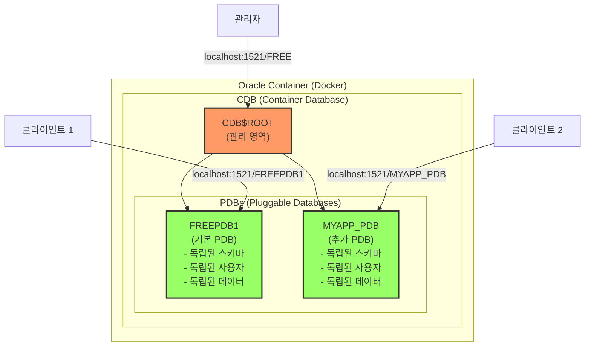

---
tags:
  - oracle
  - database
  - concepts
  - reference
---

# Oracle Database 개념 가이드

## Oracle이란?

Oracle은 원래 기업 이름이지만, Oracle Database가 너무 유명해져서 일반적으로 "Oracle"이라고 하면 Oracle Database를 지칭하는 대명사가 되었습니다.

### Oracle Corporation의 주요 제품

- **Oracle Database**: 관계형 데이터베이스 관리 시스템 (RDBMS)
- **Oracle Linux**: 기업용 Linux 운영체제
- **Java**: 프로그래밍 언어 및 플랫폼
- **MySQL**: 오픈소스 데이터베이스
- **VirtualBox**: 가상화 소프트웨어
- **WebLogic Server**: 애플리케이션 서버

## Container Registry란?

Container Registry는 Docker 이미지를 저장하고 배포하는 저장소입니다:
- **Docker Hub**: Docker의 공식 퍼블릭 레지스트리 (hub.docker.com)
- **Private Registry**: 기업이 자체 운영하는 비공개 레지스트리
- **Cloud Registry**: AWS ECR, Google GCR, Azure ACR 등

이미지를 다운로드할 때:
```bash
docker pull nginx # Docker Hub (기본)
docker pull gcr.io/project/image # Google Container Registry
docker pull container-registry.oracle.com/database/free # Oracle Container Registry
```

### Oracle Container Registry 사용 이유

Oracle은 자체 Container Registry를 운영하는데, 그에 따라 제약이 존재합니다:
- 라이센스 관리 및 사용 약관 동의 절차 필요
- Enterprise Edition은 상용 라이센스 확인 필수
- 보안 및 지원 서비스 제공을 위한 정책

이는 접근성은 떨어지지만, 기업 고객에게는 공식 지원 채널을 제공하는 장점도 있습니다.

> [!WARNING]
> Docker Hub에서 "oracle"을 검색하면 Oracle Linux 이미지만 나옵니다.
> Oracle Database 이미지는 Docker Hub에 없으니 주의하세요.
> Oracle Database는 Oracle Container Registry에서만 공식 제공됩니다.

## Oracle Database 에디션 비교

Oracle Database는 여러 에디션으로 제공되며, 각 에디션마다 제약사항이 다릅니다.

### Express Edition (XE)
- **무료** 사용 가능
- CPU: 최대 2 코어만 사용
- 데이터베이스 크기: 최대 12GB
- RAM: 최대 2GB만 사용
- 개발 및 학습 목적에 적합

### Free Edition (23c)
- **무료** 사용 가능 (2023년 출시)
- XE보다 더 많은 기능 제공
- CPU: 최대 2 스레드
- 메모리: 최대 2GB SGA + 2GB PGA
- 사용자 데이터: 최대 12GB
- 개발자를 위한 최신 버전으로 XE를 대체할 목적

> [!TIP]
> 새로 시작하는 프로젝트라면 XE보다는 Free Edition을 사용하는 것이 좋습니다.
> XE는 레거시 시스템 호환성이 필요한 경우에만 사용하고, 가능하면 최신 기능이 포함된 Free Edition을 선택하세요.

### Standard Edition 2 (SE2)
- **상용 라이센스 필수**
- 중소규모 기업용
- CPU: 최대 2 소켓까지만 지원
- RAC(Real Application Clusters) 미지원
- 고급 보안 기능 제한
- Enterprise Edition보다 저렴한 라이센스

> [!INFO]
> Oracle은 Standard Edition의 복잡한 버전 체계를 운영했습니다:
> - **SE**: 최대 4 소켓 지원
> - **SE1**: 최대 2 소켓 지원 (더 저렴한 버전)
> - **SE2**: 2015년 SE와 SE1을 통합
> 
> 현재는 SE2만 구매 가능하며, 기존 라이센스는 SE2로 전환됩니다.

### Enterprise Edition (EE)
- **상용 라이센스 필수** (가장 비싼 라이센스)
- 대규모 기업용
- 모든 기능 사용 가능
- 제한 없음
- RAC, Partitioning, Advanced Security 등 고급 기능 포함

> [!INFO]
> Oracle Enterprise Edition은 최소 수천만원부터 시작하는 고가의 상용 라이센스입니다.
> 이러한 높은 진입 장벽으로 인해 많은 기업이 PostgreSQL, MySQL 등의 오픈소스 대안을 선택합니다.

## Oracle의 핵심 개념

### Service Name vs SID

**SID (System Identifier)**
- 데이터베이스 인스턴스의 고유 식별자
- Oracle 8i 이전부터 사용된 전통적인 방식
- 하나의 인스턴스를 직접 지정
- 예: `free`, `XE`, `ORCL`

**Service Name**
- Oracle 8i부터 도입된 논리적 이름
- 하나 이상의 인스턴스를 가리킬 수 있음 (클러스터 환경에서 유용)
- 더 유연하고 현대적인 접속 방식
- 예: `FREEPDB1`, `myapp.example.com`

**Service Name은 무엇을 가리키나?**
- Service Name은 데이터베이스 자체가 아니라 **데이터베이스에 접속하는 경로**입니다
- 스키마도 아닙니다 (스키마는 사용자 계정과 그 객체들의 집합)
- 쉽게 말해 "데이터베이스의 전화번호" 같은 개념입니다
- 하나의 데이터베이스가 여러 Service Name을 가질 수 있습니다

**격리된 공간은 PDB입니다**
- **PDB (Pluggable Database)**: 격리된 독립 데이터베이스 공간
- **Service Name**: PDB에 접속하기 위한 이름표
- 예: `FREEPDB1`은 Service Name이면서 동시에 PDB 이름
- 각 PDB는 서로 격리되어 있어 독립적으로 운영됩니다

> [!TIP]
> 최신 Oracle에서는 Service Name 사용을 권장합니다.
> 접속 문자열에서 SID는 `:SID` 형식, Service Name은 `/SERVICE_NAME` 형식으로 사용합니다.

### CDB/PDB 아키텍처

PDB(Pluggable Database)는 Oracle 12c부터 도입된 멀티테넌트 아키텍처의 핵심 개념입니다.

- **CDB (Container Database)**: 전체를 관리하는 루트 컨테이너
- **PDB (Pluggable Database)**: 실제 애플리케이션이 사용하는 독립된 데이터베이스

쉽게 말해, CDB는 아파트 건물이고 PDB는 각 호실입니다. 실제 작업은 PDB에서 이루어집니다.

> [!NOTE]
> Oracle Free는 기본적으로 FREEPDB1이라는 PDB 하나를 제공합니다.
> 필요시 추가 PDB를 생성할 수 있으며, 각 PDB는 완전히 격리되어 독립적으로 운영됩니다.



> [!INFO]
> **다른 데이터베이스와 비교**
> - Oracle PDB ≈ PostgreSQL Database
> - Oracle User ≈ PostgreSQL Schema
> - Oracle CDB ≈ PostgreSQL Cluster
> 
> PostgreSQL에서 `CREATE DATABASE myapp`하듯이
> Oracle에서는 `CREATE PLUGGABLE DATABASE myapp_pdb`를 사용합니다.

### Oracle의 독특한 스키마 개념

**Oracle의 특이한 스키마 개념:**
Oracle에도 스키마가 있지만, 독특하게 작동합니다:
- **Oracle의 스키마**: User와 1:1로 매핑된 객체 컬렉션
- User를 생성하면 자동으로 같은 이름의 스키마가 생성됨
- 스키마는 그 User가 소유한 모든 객체(테이블, 뷰, 인덱스 등)의 논리적 컨테이너
- CREATE SCHEMA 명령어가 있지만, 실제로는 User 생성 시 자동으로 만들어짐

**PostgreSQL/MySQL의 스키마:**
```sql
-- PostgreSQL: Database 안에 여러 Schema 생성 가능
CREATE SCHEMA sales;
CREATE SCHEMA hr;
CREATE TABLE sales.orders (...);  -- sales 스키마에 테이블 생성
CREATE TABLE hr.employees (...);   -- hr 스키마에 테이블 생성
```

**Oracle의 스키마:**
```sql
-- Oracle: User를 만들면 Schema가 자동 생성됨
CREATE USER sales IDENTIFIED BY password;
CREATE USER hr IDENTIFIED BY password;
-- sales 사용자로 로그인하면 sales 스키마에서 작업
-- hr 사용자로 로그인하면 hr 스키마에서 작업
```

**핵심 차이점:**
- **다른 DB**: Schema는 테이블을 그룹화하는 논리적 네임스페이스
- **Oracle**: Schema는 존재하지만 User와 분리할 수 없음 (User = Schema Owner)
- **다른 DB**: 한 사용자가 여러 스키마 생성/소유 가능
- **Oracle**: 한 사용자 = 한 스키마 (1:1 고정 관계)

**주의: User 생성 ≠ PDB 생성**
```sql
-- PDB 안에서 User 생성 (같은 PDB 내의 새 스키마)
CREATE USER student IDENTIFIED BY pass123;  -- FREEPDB1 안에 student 스키마 생성
CREATE USER teacher IDENTIFIED BY pass456;  -- FREEPDB1 안에 teacher 스키마 생성

-- 모두 같은 FREEPDB1 안에 있음! 새 PDB가 생기는 게 아님
-- PDB는 CREATE PLUGGABLE DATABASE로만 생성
```

**Oracle에서 User = Schema인 이유:**
```sql
-- student로 로그인하면
CREATE TABLE scores (id NUMBER);  -- student.scores 테이블 생성됨

-- teacher로 로그인하면  
CREATE TABLE classes (id NUMBER); -- teacher.classes 테이블 생성됨

-- 다른 사용자의 테이블에 접근하려면
SELECT * FROM student.scores;     -- teacher가 student의 테이블 조회
```

Oracle에서는 사용자를 만들면 자동으로 그 사용자 이름과 동일한 스키마가 생성됩니다.
이 스키마는 그 사용자가 만든 모든 객체(테이블, 뷰 등)를 담는 공간입니다.

### 사용자 권한 체계

**PDB 내 사용자 권한 체계:**
```sql
-- 일반 사용자: 자기 스키마에서만 작업
CREATE USER student IDENTIFIED BY pass123;
GRANT CREATE SESSION, CREATE TABLE TO student;

-- DBA 권한 사용자: PDB 전체 관리
CREATE USER pdb_admin IDENTIFIED BY admin123;
GRANT DBA TO pdb_admin;  -- PDB 내 모든 권한

-- 다른 스키마 접근 권한 부여
GRANT SELECT ON student.scores TO teacher;  -- teacher가 student.scores 조회 가능
```

**사용자 유형:**
- **일반 사용자**: 자기 스키마에서만 작업 (기본)
- **DBA 권한 사용자**: PDB 내 모든 스키마 접근/관리 (Database Administrator = 데이터베이스 관리자)
- **SYS/SYSTEM**: CDB 및 모든 PDB 관리 (최고 권한)

**DBA 권한의 의미:**
- DBA = Database Administrator (데이터베이스 관리자)
- `GRANT DBA TO user`는 "이 사용자를 관리자로 만들어라"는 의미
- PDB 내에서 거의 모든 작업 가능 (테이블 생성/삭제, 사용자 관리, 백업 등)
- 단, 다른 PDB에는 접근 불가 (PDB별로 독립된 관리자)

> [!NOTE]
> **Oracle 용어의 특징**
> 
> Oracle은 자체적인 용어 체계를 사용합니다:
> - 멀티테넌트 아키텍처를 위해 CDB/PDB 개념 도입 (12c부터)
> - 기존 단일 인스턴스 구조에서 클라우드 시대에 맞춰 진화
> - 학습 곡선이 높지만, 대규모 엔터프라이즈 환경에서는 유용한 기능
> 
> 다만 작은 프로젝트에서는 PostgreSQL 등 더 단순한 대안을 고려해볼 만합니다.

## 접속 정보

### Oracle Database 23c Free 접속 정보
- **SID**: free (소문자)
- **Service Name (CDB)**: FREE - 루트 컨테이너 접속용
- **Service Name (PDB)**: FREEPDB1 - 실제 데이터베이스 접속용

일반적으로 애플리케이션은 PDB인 FREEPDB1에 접속합니다.
접속 문자열 예시: `username/password@hostname:1521/FREEPDB1`

### 미끼 상품 전략

> [!INFO]
> 대부분의 Container Registry는 로그인 후 이미지를 다운로드하는 것이 원칙입니다.
> 하지만 Oracle은 Free Edition을 "미끼 상품"으로 활용하여 로그인 없이도 다운로드할 수 있게 허용합니다.
> Enterprise Edition이나 Standard Edition은 여전히 Oracle 계정 로그인이 필수입니다.