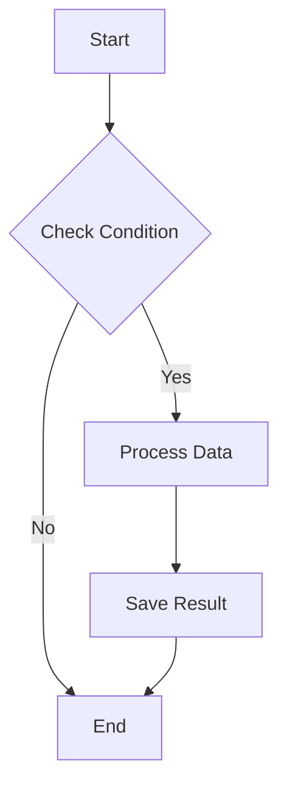
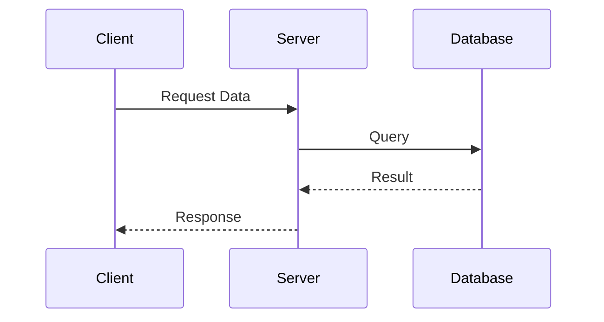
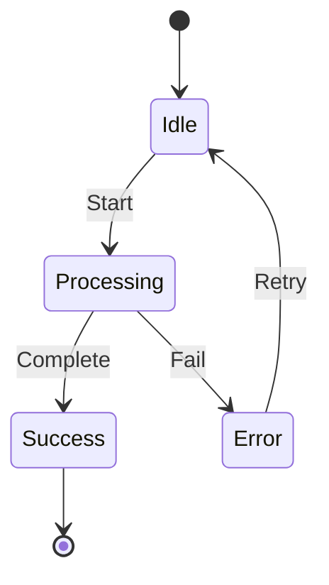
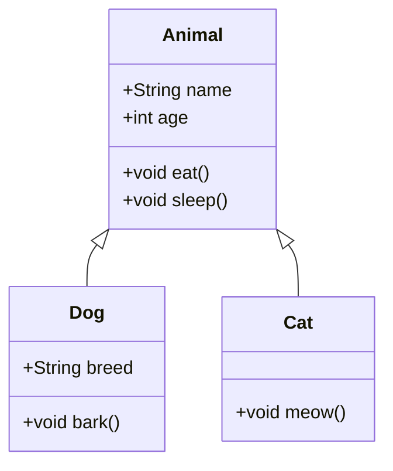

# Obsidian 기본 마크다운 기능

> [!NOTE]
> 플러그인 없이 Obsidian에서 기본적으로 사용할 수 있는 코드 블록 기능들입니다.

## 프로그래밍 언어 코드 블록

### Java
```java
public class HelloWorld {
    public static void main(String[] args) {
        System.out.println("Hello, Obsidian!");
        // This is a comment
    }
}
```

### Python
```python
def fibonacci(n):
    if n <= 1:
        return n
    return fibonacci(n-1) + fibonacci(n-2)

# Generate fibonacci sequence
result = [fibonacci(i) for i in range(10)]
print(result)
```

### JavaScript
```javascript
const fetchData = async (url) => {
    try {
        const response = await fetch(url);
        return await response.json();
    } catch (error) {
        console.error('Error:', error);
    }
};
```

### SQL
```sql
SELECT
    u.name,
    COUNT(o.id) as order_count,
    SUM(o.total) as total_spent
FROM users u
LEFT JOIN orders o ON u.id = o.user_id
WHERE o.created_at >= '2024-01-01'
GROUP BY u.id, u.name
ORDER BY total_spent DESC;
```

## Mermaid 다이어그램 (기본 지원)

### 플로우차트


### 시퀀스 다이어그램


### 상태 다이어그램


### 클래스 다이어그램


## 수학 공식 (LaTeX)

### 인라인 수식
이차 방정식 $ax^2 + bx + c = 0$의 해는 $x = \frac{-b \pm \sqrt{b^2-4ac}}{2a}$ 입니다.

### 블록 수식
정규분포의 확률밀도함수:
$$
f(x) = \frac{1}{\sigma\sqrt{2\pi}} e^{-\frac{1}{2}\left(\frac{x-\mu}{\sigma}\right)^2}
$$

푸리에 변환:
$$
\hat{f}(\xi) = \int_{-\infty}^{\infty} f(x) e^{-2\pi i x \xi} dx
$$

## 테이블 (기본 마크다운)

| Method | Time Complexity | Space Complexity |
|--------|----------------|------------------|
| Bubble Sort | O(n²) | O(1) |
| Quick Sort | O(n log n) | O(log n) |
| Merge Sort | O(n log n) | O(n) |
| Heap Sort | O(n log n) | O(1) |

## 체크리스트

프로젝트 진행 상황:
- [x] Requirements Analysis
- [x] Database Design
- [ ] API Development
  - [x] User Authentication
  - [ ] Data CRUD Operations
  - [ ] File Upload
- [ ] Frontend Development
- [ ] Testing
- [ ] Deployment

## Callout 박스

> [!NOTE]
> 기본 정보를 전달할 때 사용합니다.

> [!TIP]
> 유용한 팁이나 권장사항을 제공합니다.

> [!WARNING]
> 주의해야 할 사항을 강조합니다.

> [!DANGER]
> 심각한 문제나 위험을 경고합니다.

> [!INFO]
> 추가적인 배경 정보를 제공합니다.

> [!SUCCESS]
> 성공적인 완료를 나타냅니다.

> [!QUESTION]
> 질문이나 고려사항을 제시합니다.

> [!ABSTRACT]
> 요약이나 개요를 표시합니다.

## 인용구와 강조

### 인용구
> "The only way to do great work is to love what you do."
> — Steve Jobs

### 중첩 인용구
> 첫 번째 레벨
>> 두 번째 레벨
>>> 세 번째 레벨

### 텍스트 강조
- **굵은 글씨** 또는 __굵은 글씨__
- *기울임* 또는 _기울임_
- ***굵은 기울임*** 또는 ___굵은 기울임___
- ~~취소선~~
- ==하이라이트== (Obsidian 전용)

## 리스트

### 순서 있는 리스트
1. First item
2. Second item
   1. Sub-item 2.1
   2. Sub-item 2.2
3. Third item

### 순서 없는 리스트
- Main point
  - Sub point
    - Sub-sub point
  - Another sub point
- Another main point

## 구분선

세 개 이상의 하이픈, 별표, 언더스코어:

---

***

___

## 이미지와 링크

### 링크
[Obsidian 공식 사이트](https://obsidian.md)

### 이미지


### 이미지 크기 조절 (Obsidian 전용)


> [!TIP]
> 이러한 기본 기능만으로도 충분히 풍부한 문서를 작성할 수 있습니다!

## 다음 단계

마크다운 기능을 익혔다면:
- [동기화 설정](step-01.md) - 여러 기기에서 노트 사용하기